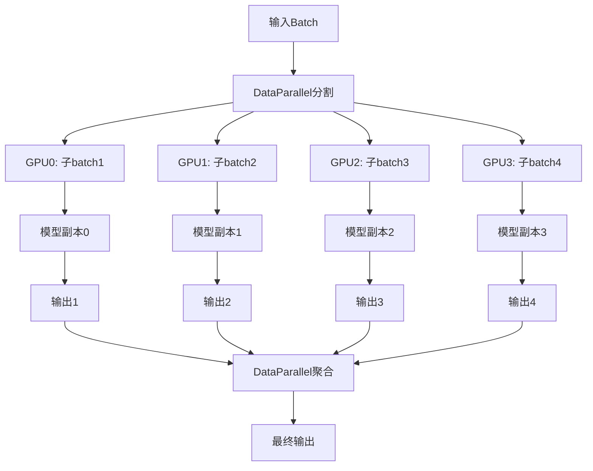
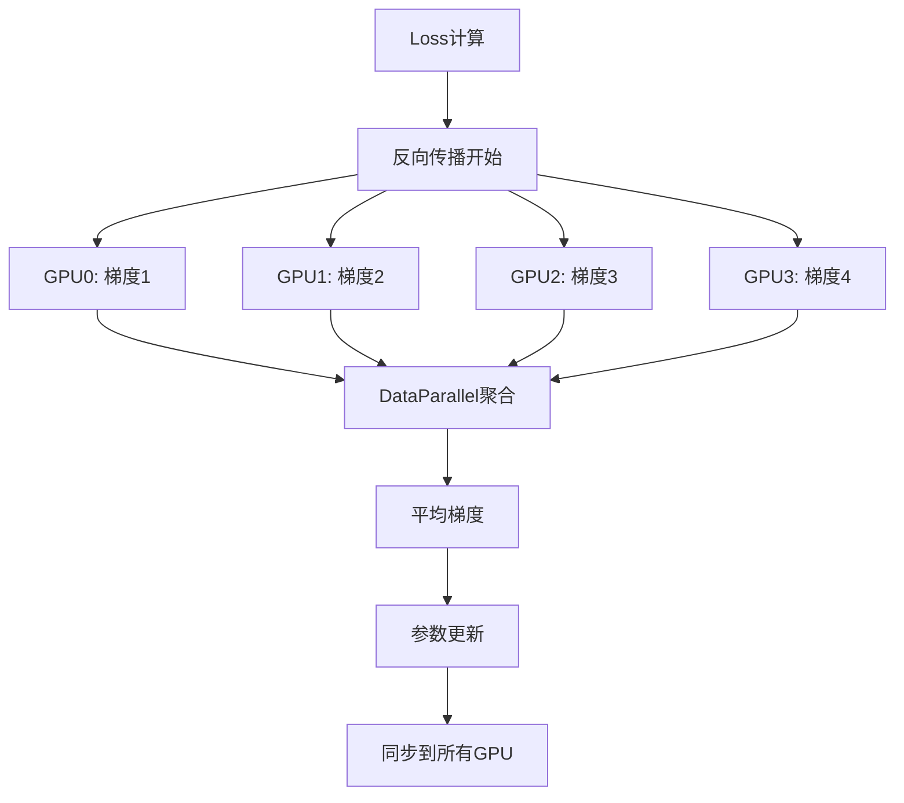

# 数据并行核心原理与实现详解

## 概述

本文档深入分析 `train_tmp.py` 中数据并行的核心思想、实现原理，以及梯度聚合和loss流动机制。数据并行是深度学习训练中最重要的并行化技术之一，能够显著提升训练效率。

## 数据并行的核心思想

### 1. 基本概念

**数据并行（Data Parallelism）** 的核心思想是：
- **模型复制**：将同一个模型复制到多个GPU上
- **数据分片**：将batch数据分割成多个子batch，每个GPU处理一个子batch
- **梯度聚合**：收集所有GPU上的梯度，进行平均聚合
- **参数同步**：将聚合后的梯度更新到所有GPU的模型参数上

### 2. 为什么能用数据并行？

数据并行之所以可行，基于以下数学原理：

#### 2.1 梯度平均的数学等价性

假设有N个GPU，每个GPU处理一个子batch，梯度分别为 `g1, g2, ..., gN`：

```
原始batch的梯度 = (g1 + g2 + ... + gN) / N
```

这个平均梯度等价于在原始完整batch上计算的梯度，因为：
- 损失函数是batch中所有样本损失的平均值
- 梯度的线性性质保证了这种等价性

#### 2.2 代码中的体现

```python
# train_tmp.py 第410-417行
if use_multi_gpu and gpu_count > 1:
    # 增加batch size以充分利用多GPU
    effective_batch_size = batch_size * gpu_count
    # 增加数据加载worker数量
    effective_num_workers = min(num_workers * 2, 8)  # 最多8个worker
    logger.info(
        f"多卡训练优化: batch_size {batch_size} -> {effective_batch_size}, num_workers {num_workers} -> {effective_num_workers}")
```

**说明**：
- `effective_batch_size = batch_size * gpu_count`：总batch size = 单卡batch size × GPU数量
- 每个GPU处理 `batch_size` 大小的数据
- 等价于在 `effective_batch_size` 大小的数据上训练

## 数据并行的实现机制

### 1. 模型包装 - DataParallel

```python
# train_tmp.py 第120-132行
def wrap_model_for_multi_gpu(model, use_multi_gpu, gpu_count):
    """
    为多卡训练包装模型
    """
    if use_multi_gpu and gpu_count > 1:
        logger.info(f"使用DataParallel包装模型，GPU数量: {gpu_count}")
        # 设置DataParallel的父device_ids参数
        device_ids = list(range(gpu_count))
        model = DataParallel(model, device_ids=device_ids)
        return model
    else:
        logger.info("使用单卡训练")
        return model
```

#### 1.1 DataParallel的工作机制

```python
# PyTorch DataParallel内部机制（简化版）
class DataParallel:
    def __init__(self, module, device_ids):
        self.module = module  # 原始模型
        self.device_ids = device_ids  # GPU设备列表
    
    def forward(self, input):
        # 1. 将输入数据分割到多个GPU
        inputs = scatter(input, self.device_ids)
        
        # 2. 在每个GPU上复制模型并前向传播
        replicas = replicate(self.module, self.device_ids)
        outputs = parallel_apply(replicas, inputs)
        
        # 3. 收集所有GPU的输出
        return gather(outputs, self.device_ids[0])
```

### 2. 数据流动过程

#### 2.1 前向传播流程



#### 2.2 代码中的实现

```python
# train_tmp.py 第1519-1524行
transformer_output = transformer(
    inp, tar_inp,
    src_mask=enc_pad_mask,
    tgt_mask=dec_mask,
    enc_dec_mask=enc_dec_mask
)
```

**说明**：
- `transformer` 已经被 `DataParallel` 包装
- 输入数据自动分割到多个GPU
- 每个GPU上的模型副本并行处理
- 输出自动聚合到主GPU

### 3. 梯度聚合机制

#### 3.1 反向传播流程



#### 3.2 代码中的梯度处理

```python
# train_tmp.py 第1540-1547行
optimizer.zero_grad(set_to_none=True)
loss.backward()

# 改进的梯度裁剪策略
# 1. 先计算梯度范数
# 对于DataParallel包装的模型，需要访问module属性
model_for_grad_clip = transformer.module if use_multi_gpu else transformer
grad_norm = torch.nn.utils.clip_grad_norm_(model_for_grad_clip.parameters(), max_norm=0.5)
```

**关键点**：
- `transformer.module`：访问DataParallel包装的原始模型
- `loss.backward()`：自动触发梯度聚合
- 梯度裁剪在聚合后的梯度上进行

### 4. 内存和计算优化

#### 4.1 内存优化

```python
# train_tmp.py 第488-489行
pin_memory=True if torch.cuda.is_available() else False,  # 多卡训练时启用pin_memory
```

**pin_memory的作用**：
- 将数据固定在CPU内存中，避免页面交换
- 加速CPU到GPU的数据传输
- 特别重要于多GPU环境下的数据传输

#### 4.2 Worker优化

```python
# train_tmp.py 第414-415行
# 增加数据加载worker数量
effective_num_workers = min(num_workers * 2, 8)  # 最多8个worker
```

**Worker优化的意义**：
- 多GPU训练需要更多数据预加载
- 避免GPU等待数据加载的空闲时间
- 提高整体训练效率

## Loss和指标的计算与聚合

### 1. Loss计算机制

#### 1.1 分布式Loss计算

```python
# train_tmp.py 第1533行
loss = loss_function(tar_real, logits, router_logits=router_logits, moe_config=moe_config)
```

**DataParallel中的Loss计算**：
- 每个GPU计算自己子batch的loss
- DataParallel自动将loss聚合（通常是平均）
- 最终loss是所有GPU上loss的平均值

#### 1.2 Loss聚合的数学原理

```
总Loss = (Loss_GPU0 + Loss_GPU1 + ... + Loss_GPUN) / N
```

这等价于在完整batch上计算的loss，因为：
- 每个GPU的loss是其子batch的平均loss
- 所有子batch的平均loss的平均值 = 完整batch的平均loss

### 2. 准确率等指标的计算

#### 2.1 准确率聚合

```python
# train_tmp.py 第1572行
acc = token_accuracy(tar_real, logits, pad_id=TGT_PAD_ID)
```

**准确率聚合机制**：
- 每个GPU计算自己子batch的准确率
- 最终准确率是所有GPU准确率的加权平均
- 权重基于各子batch的有效token数量

#### 2.2 指标聚合的代码实现

```python
# train_tmp.py 第1476-1482行
@torch.no_grad()
def token_accuracy(real, pred, pad_id):
    pred_ids = pred.argmax(dim=-1)  # (B, L)
    mask = (real != pad_id)
    correct = ((pred_ids == real) & mask).sum().item()
    denom = mask.sum().item()
    return correct / max(1, denom)
```

## 多卡训练的挑战与解决方案

### 1. 梯度同步开销

**挑战**：梯度聚合需要GPU间通信，可能成为瓶颈

**解决方案**：
```python
# train_tmp.py 第1546行
model_for_grad_clip = transformer.module if use_multi_gpu else transformer
```
- 访问原始模型进行梯度裁剪，避免重复通信
- 优化梯度裁剪策略，减少通信次数

### 2. 内存管理

**挑战**：多GPU环境下内存使用复杂

**解决方案**：
```python
# train_tmp.py 第142-150行
def log_gpu_memory_usage(step_name="", use_multi_gpu=False, gpu_count=1):
    if use_multi_gpu and gpu_count > 1:
        for i in range(gpu_count):
            memory_allocated = torch.cuda.memory_allocated(i) / 1024 ** 3
            memory_reserved = torch.cuda.memory_reserved(i) / 1024 ** 3
            logger.info(f"GPU {i} {step_name} - 内存使用: {memory_allocated:.2f}GB/{memory_reserved:.2f}GB")
```
- 实时监控所有GPU的内存使用
- 及时发现内存泄漏或溢出问题

### 3. 模型状态管理

**挑战**：DataParallel包装后的模型状态管理

**解决方案**：
```python
# train_tmp.py 第1937-1938行
# 对于DataParallel包装的模型，保存原始模型的状态
model_state = model.module.state_dict() if use_multi_gpu else model.state_dict()
```
- 保存和加载时访问原始模型状态
- 避免DataParallel包装层的干扰

## 性能分析

### 1. 理论加速比

**理想情况**：N个GPU的加速比接近N倍

**实际限制**：
- 梯度聚合的通信开销
- 数据传输的时间成本
- 负载不均衡问题

### 2. 实际性能优化

```python
# train_tmp.py 第412-413行
# 增加batch size以充分利用多GPU
effective_batch_size = batch_size * gpu_count
```

**优化策略**：
- 增大batch size以充分利用GPU计算能力
- 增加数据加载worker数量
- 启用pin_memory加速数据传输
- 优化梯度裁剪策略

## 代码架构总结

### 1. 核心组件

| 组件 | 作用 | 代码位置 |
|------|------|----------|
| **setup_multi_gpu()** | 检测和设置多GPU环境 | 第98-117行 |
| **wrap_model_for_multi_gpu()** | DataParallel模型包装 | 第120-132行 |
| **build_dataloaders()** | 多GPU优化的数据加载 | 第379-500行 |
| **train_step()** | 多GPU训练步骤 | 第1496-1573行 |
| **save_ckpt/load_ckpt()** | 多GPU模型保存/加载 | 第1922-1988行 |

### 2. 数据流动总结

```
输入数据 → DataParallel分割 → 多GPU并行处理 → 输出聚合 → Loss计算 → 梯度聚合 → 参数更新 → 同步到所有GPU
```

### 3. 关键设计原则

1. **透明性**：整个训练流程对多GPU透明，代码结构保持一致
2. **效率性**：最大化利用多GPU的计算和内存资源
3. **稳定性**：增强的异常检测和错误处理机制
4. **可扩展性**：支持动态GPU数量配置

## 总结

`train_tmp.py` 中的数据并行实现体现了现代深度学习训练的最佳实践：

1. **核心思想**：通过数据分片和梯度聚合实现并行训练
2. **数学基础**：基于梯度平均的数学等价性
3. **实现机制**：DataParallel自动处理数据分发和梯度聚合
4. **性能优化**：batch size扩展、内存优化、通信优化
5. **工程实践**：完善的错误处理、状态管理、监控机制

这种设计使得模型能够在保持训练正确性的同时，充分利用多GPU的计算能力，实现显著的训练加速。
